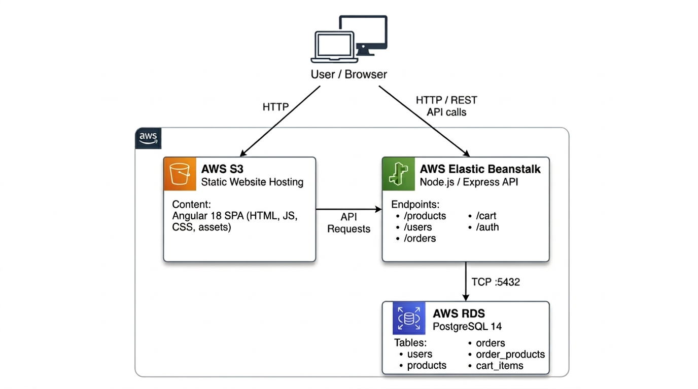
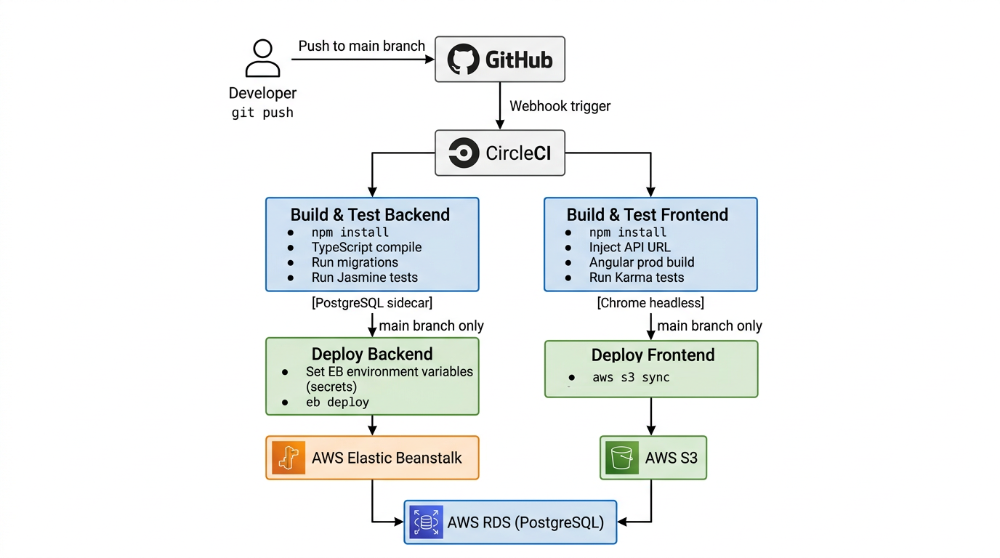

# Architecture Diagrams

This document provides a high-level overview of the application infrastructure and the CI/CD pipeline.

---

## 1. Infrastructure Diagram

The diagram below shows how the three AWS services interact to serve the application.

**Communication flow:**
1. User loads the Angular SPA from the S3 static website URL over HTTP.
2. The Angular app makes REST API calls to the Elastic Beanstalk URL.
3. Elastic Beanstalk (Node/Express) queries the RDS PostgreSQL database over TCP port 5432.
4. RDS is not publicly accessible; it only accepts connections from the EB security group.

| AWS Service | Role | Details |
|---|---|---|
| **AWS S3** | Static Website Hosting | Serves the Angular 18 SPA (index.html, JS bundles, CSS, assets) |
| **AWS Elastic Beanstalk** | Backend API | Runs the Node.js/Express REST API (products, users, orders, cart, auth endpoints) |
| **AWS RDS** | Database | PostgreSQL 14 — stores users, products, orders, order_products, cart_items, addresses, refresh_tokens |

---

## 2. CI/CD Pipeline Diagram

The diagram below shows the CircleCI pipeline triggered on every push to GitHub.

**Pipeline flow:**
1. Developer pushes code to GitHub (main branch).
2. GitHub webhook triggers CircleCI.
3. Two build/test jobs run **in parallel**:
   - **Build & Test Backend** — installs dependencies, compiles TypeScript, runs database migrations, executes Jasmine tests (with a PostgreSQL sidecar container).
   - **Build & Test Frontend** — installs dependencies, injects the EB API URL, builds the Angular production bundle, runs Karma tests in headless Chrome.
4. On the **main branch only**, after tests pass, two deploy jobs run:
   - **Deploy Backend** — sends all application secrets from CircleCI to the EB environment via `eb setenv`, then deploys the built app with `eb deploy`.
   - **Deploy Frontend** — syncs the compiled Angular bundle to the S3 bucket with `aws s3 sync`.
5. All secrets (AWS keys, JWT secret, DB credentials, etc.) are stored in CircleCI as encrypted project environment variables and forwarded to EB at deploy time — they never appear in source code.
